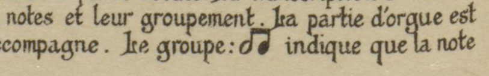

# View the PDF

Click [here to download a PDF copy of my PhD](http://www.tara.tcd.ie/handle/2262/100565) and view the LaTeX output.

<br />
<br />

<!-- ## Table of contents
 - [Technical setup](#item-one)
 - [Footnotes and bibliography](#bibliography)
 - [Typesetting](#typesetting)
 - [Pitch class notation](#pitch-class)
 - [Helmholtz pitch notation](#helmholtz)
 - [Music examples](#music-examples)
 - [Symbology](#symbology) -->


# TeX and LaTeX


## Installing TeX Live

Installing [TeX Live](https://www.tug.org/texlive/) will provide all the packages ones needs to compile this dissertation.
It also includes the LuaLaTeX typesetting engine, the compiler that interprets plain text files to produce a PDF.
Installation instructions are provided on [this page](https://www.tug.org/texlive/quickinstall.html).

To install TeX Live on Linux Debian, take note of the following:
* The `install-tl` installation package requires perl. This is not installed by default so one needs to run `sudo apt install perl`.
* Under the installation options, make sure to enable _allow execution of restricted list of programs via \write18_.
This allows TeX to call [Lilypond](http://lilypond.org/) (and [Gregorio](https://gregorio-project.github.io/installation.html), though I did not use this) executables directly from within a TeX file.


Check your TeX Live installation by running `lualatex -v` in a shell.

<br />

## Installing Lilypond

If you're on Windows or Mac, you can install the stable release of Lilypond by downloading it from the [Lilypond website](http://lilypond.org/).
The easiest way to install [Lilypond on Debian](https://packages.debian.org/search?keywords=lilypond) is to do so by running `sudo apt install lilypond` in a shell.
Check your installation by running `lilypond -v`.

<br />

## Compilation

The `--shell-escape` flag must be included when running `lualatex`.
This is required to allow LuaLaTeX to run shell commands, in this case to call the Lilypond program to produce my music examples.
Multiple passes of LuaLaTeX are required so that the engine can typeset page breaks and cross references properly.
A complete compilation to fully compile the document may be run iteratively as follows:

```bash
lualatex -interaction=nonstopmode --shell-escape thesis.tex
biber --output-safechars thesis
lualatex -interaction=nonstopmode --shell-escape thesis.tex
lualatex -interaction=nonstopmode --shell-escape thesis.tex
texcount -merge thesis.tex | grep "Words in text"
```

My use of `biber` and the `--output-safechars` option are described below in the section on footnotes and bibliographies.
In the course of writing, I use an abridged compilation routine to check formatting is behaving as expected:

```bash
lualatex -interaction=nonstopmode --shell-escape thesis.tex
texcount -merge thesis.tex | grep "Words in text"
```

The latter will only work if the document has previously been fully compiled.


<br />
<br />

# Typesetting

## Music

A chief requirement I have is that my music examples should be rendered in the highest quality possible.
The Microsoft Word method of inserting snippets of music as images proved disastrous, however.
One needs first to compile the music examples using one's typesetting software of choice, save these as images, and then insert them into Word.
Making a change to a music example is tedious and requires everything to be redone from scratch.
Trouble arises when inserting the images into Word because the software down-samples images to maintain the performance of the application.
Although one can turn off down-sampling in Word via File > Options > Advanced > Image Size and Quality (the default is a miserable 220dpi), your computer will soon run out of RAM, leading to crashes and corrupted documents.
I needed to eliminate the possibility of data problems so I ruled out Word fairly early on.

I was already familiar with the typesetting software [Lilypond](https://lilypond.org/), whose typesetting rules can easily be manipulated to produce the desired output.
After a bit of research I found that Lilypond code could be interpreted by the LaTeX compiler to produce music examples at runtime.
When the LaTeX engine encounters this code it runs the Lilypond software to produce the music examples, taking into account margins, system breaks, page breaks and so on.
LaTeX renders the music examples as fully native PDFs so there is scant possibility for blurred images or strange artefacts around the edges of glyphs.
Online resources that are reputed to instruct in how to achieve this are very old; therefore, I hope that the product of my own research and experience in this area may save you some time.

The Lilypond manual recommends using a LaTeX package called [lilypond-book](https://lilypond.org/doc/v2.23/Documentation/usage/lilypond_002dbook).
It is meant to function as a sort of translator between the Lilypond program and your LaTeX compiler.
I imagine this package was invented with producing complete scores in mind, because any time I tried to insert a snippet of music spanning a few bars it never worked as expected.
`Lilypond-book` requires its own [separate compilation step](https://lilypond.org/doc/v2.23/Documentation/usage/invoking-lilypond_002dbook) but this has the inestimable drawback of slowing down its users.

After some research I came upon the excellent alternative package [lyluatex](https://github.com/jperon/lyluatex) that handles snippets of music perfectly, and I highly commend it to anybody seeking to produce music within LaTeX.
Page and system breaks are handled automatically depending on one's document settings.
It uses the LuaLaTeX engine to insert music by two methods, either by including an entire Lilypond `.ly` file or by interpreting inline Lilypond code placed directly into your `.tex` file.
I tend to prefer whole-file `.ly` inclusion for anything more complex than a single system for no reason other than to maintain the source code with Git.
I use the Lilypond GUI [Frescobaldi](https://www.frescobaldi.org/) to typeset the music examples (install this by running `sudo apt install frescobaldi`), and the resulting files are then easily version controlled

<br />

### Including a lilypond file
Render a Lilypond `.ly` file natively by including it easily as using the `includely` command:

````latex
\includely[nofragment,staffsize=14]{c/2/ex/benoist/dissonancesbass}
````


<br />

### In-file snippets
Insert music inline by wrapping your Lilypond code in the `\lilypond{}` command:

````latex
......to \lilypond[notime]{<< {\voiceOne \clef "alto" cis'1 d'} {\voiceTwo e' d'}>>},.....
````


See what the `nofragment`, `staffsize` and `notime` options do by reading the `lyluatex` [documentation](https://ftp.heanet.ie/mirrors/ctan.org/tex/support/lyluatex/lyluatex.pdf). 


<br />
<br />


## Fonts

The `fontenc` package specifies the font encoding of the document.
By default LaTeX uses the <kbd>OT1</kbd> encoding which is limited in supporting accented characters and symbols.
<kbd>T1</kbd> encoding is recommended for documents that contain non-English text or special characters, and it is easily set by using the `fontenc` package:

```latex
\usepackage[T1]{fontenc}
```

The `fontspec` package further allows one to access fonts installed on the user's system directly from within a LuaLaTeX document.
This is a feature of Microsoft Word that we take for granted, but LaTeX being from the 1980s requires more explicit font management.
The benefit to invoking the `fontspec` package extends to being able to manipulate font features such as size, weight and style:

```latex
\usepackage{fontspec}
```

## Text

I set myself against the default LaTeX font [Computer Modern](https://en.wikipedia.org/wiki/Computer_Modern).
I went through much toil in locating a suitable Times New Roman font, so I hope that the fruit of my research in this area can be of use to anyone seeking to use this font in LaTeX.
The principal stumbling block is the lack of a native Times New Roman font for LaTeX.
This might seem surprising given Times's widespread popularity, but one must remember that the TeX ecosystem revolves around open-source software for the most part and that Times New Roman is a proprietary font.
What we are looking for therefore is a clone.

There is no shortage of clones and ancient tutorials and blog posts recommend one or another, producing unreliable results on modern systems.
The `times` package sound promising but is obsolete so don't waste your time.
It was supposedly replaced by the `mathptmx` package which, in tandem with `newtxtext` and its mathematics version `newtxmath`, are touted as viable alternatives.
But UTF-8 coverage is poor in these; and the availability of characters that are supposed to ligate (fi > fi) is worse.

I finally chanced upon the The New Roman clone [Tex Gyre Termes](https://www.tug.org/FontCatalogue/texgyretermes) and this proved to be the answer I was seeking all along.
It is technically a derivative of the font [Nimbus Roman No9 L](https://www.fontsquirrel.com/fonts/nimbus-roman-no9-l) that extends Times New Roman to comprise more [unicode glyphs](https://ftp.heanet.ie/mirrors/ctan.org/tex/fonts/tex-gyre/doc/qtm-info.pdf#page=4).
It comes in normal, italics, bold, and bold-italic versions, and there are small-capital versions to boot, not to mention the excellent coverage of ligatures (fi, æ, œ).
Simply add this to your preamble and you are in business:

````latex
\setmainfont{Tex Gyre Termes}
````

Although this font offered up the widest range of glyphs I could find, I still ran into some cases where it did not have everything I needed.
Typesetting the Greek phrase 'ῥυθμός' required some typographical sleight of hand, for example.
I borrow the missing glyphs from a separate typeface, namely [Linux Libertine O](https://www.cufonfonts.com/font/linux-libertine-o)...

````latex
\newfontfamily\greekfont[Script=Greek]{Linux Libertine O}
````

...and invoke it thus, reverting to the Roman font family immediately after use:

````latex
\greekfont{ῥυθμός}\rmfamily
````

<br />
<br />

<a id="pitch-class"></a>
## Pitch classes

For musicological reasons that I won't get into here I needed a way of representing pitch classes.
I implement in my dissertation the practice adopted by most conventional text books.
My methodology is to temporarily switch to the LaTeX mathematics environment to typeset the wide hat symbol, `\what` above the numeral.
This symbol is wide enough to span the entire numeral and gives the most convincing visual result in my comparative tests.
Using the LaTeX mathematics environment makes the true minus sign available to specify negative pitches.
This sign is a specific character distinct from both the hyphen and en dash and is encoded as its own unicode value (U+2212).
The result is convincing:

| LaTeX code  	                        |  Result 	                                      |
|---	                                  |---	                                            |
| `$\what{2}$ \rightarrow{} $\what{1}$` |  	| 
|`$-\what{7}\kern 1pt\sharp{}$`         |     | 


Using `\pitch{2}` will print the numeral `2` with a carat above, as displayed in the image above.
`\negpitch{2}` prints the same thing but with a minus sign in front of it.
There are also `\abspitch{2}` and `\negabspitch{2}` which eventually I ended up not using.

### Mathematics font

Setting the main font in LaTeX does not affect the font in the mathematics environment.
Therefore in typesetting pitch classes with the LaTeX mathematics environment, Tex Gyre Termes is of little use and the numbers remain in the dreaded Computer Modern font.
Advice online for adopting Times New Roman in the mathematics environment centres around loading either the package [unicode-math](https://ctan.org/pkg/unicode-math?lang=en) and invoking `\setmathfont{TeX Gyre Termes Math}`, or loading `newtxmath`.
Neither works.
The latter produces unpredictable output whereas with former's use of `unicode-math` suppresses some crucial musical symbols from the `lilyglyphs` package that I was using elsewhere in the document, thwarting this cornerstone of my dissertation.

The solution is to install the free, lite subset of the commercial mathematics font MathTime Pro 2, [mtpro2](https://ctan.org/pkg/mtp2lite?lang=en).
It includes numbers and symbols in Times New Roman for the LaTeX mathematics environment, including the pleasant wide hat glyph seen above.

To install on Windows try [these instructions](https://pctex.com/kb/62.html), noting [this answer](https://tex.stackexchange.com/a/598649).

To install the font on Linux and MacOS instructions are available [here](https://github.com/jamespfennell/mathtime-installer).
My method differed slightly so I'll provide them here:

1. [Download a copy of the font](https://ftp.heanet.ie/mirrors/ctan.org/tex/fonts/mtp2lite.zip)
2. Download [this shell script](https://github.com/jamespfennell/mathtime-installer/blob/master/mtpro2-texlive.sh)
3. Place the script in the same directory as the zip file and rename it `./mtpro2-texlive.sh`
4. Make it executable by running `chmod +x mtpro2-texlive.sh`
5. Run the following command `./mtpro2-texlive.sh -i mtp2lite.zip` (NB without sudo)

Note that when I attempt to use this script I receive the following error:


The culprit is in the `unzip_and_copy` method where the script invokes `sudo` when this is unnecessary, causing the `texhash` and `updmap-sys` functions to fail.
Removing `sudo` from lines 225, 228, 230, 232, 234, 236 and 254 solves this problem:


Running `updmap-sys --enable Map mtpro2.map` is the important command.

<br />
<br />

<a id="helmholtz"></a>
## Primes and sub-primes
Describing the length of organ pipes in feet requires prime symbols, as does [Helmholtz pitch notation](https://en.wikipedia.org/wiki/Helmholtz_pitch_notation), a method for describing specific pitches.
Helmholtz published his method in [1863](https://www.digitale-sammlungen.de/de/view/bsb10598685?page=45) which uses letters and symbols to fix a pitch to a particular octave.
These symbols are either the superscript or subscript prime depending on the octave.
Originally, Helmholtz's publisher typeset what would later become subscript primes as subscript roman numerals.
It is beyond the scope I have set myself here to discuss the history of Helmholtz pitch notation (however worthy the topic may be deserving of treatment elsewhere), save to note that the system saw no revision through the fifth German edition of [1896](https://www.digitale-sammlungen.de/view/bsb11822278?page=60) and that its French translation proffered a different system altogether that makes use of of solfège pitches with numbers.
Seeing as the last could quite readily be confused with [Scientific Pitch Notation](https://en.wikipedia.org/wiki/Scientific_pitch_notation) it is hardly surprising that it hasn't caught on.

Helmholtz's [Anglophone translation](https://archive.org/details/onsensationsofto00helmrich/page/16/mode/2up) adds the description 'inverted accent' to the prose describing subscript symbols, these being typeset as subscript primes.
Since these prime and subprime symbols have become conventional in the Anglosphere I decided to maintain their use and typesetting in LaTeX.
Kerning the subprime character left by one point improves legibility.

Click [here](https://www.overleaf.com/read/jnryjgmbjfjw#78b51f) to see this code on Overleaf.

|  LaTeX code                        	      |  Result 	|
|---	                                      |---	|
| ``8$^\prime$~Flûte``                      	|   	|
| ``\$\emph{F}\kern -1pt`$``                    |     |
| ``$\emph{F}\kern -1pt\`$--\emph{f}$^{\prime\prime\prime}$`` |   | 

### TeX code


```tex
\makeatletter
\def\active@math@sprime{_\bgroup\sprim@s}
{\catcode`\`=\active \global\let`\active@math@sprime}
\def\sprim@s{%
  \prime\futurelet\@let@token\spr@m@s}
\def\spr@m@s{%
  \ifx`\@let@token
    \expandafter\spr@@@s
  \else
    \ifx_\@let@token
      \expandafter\expandafter\expandafter\spr@@@t
    \else
      \egroup
    \fi
  \fi}
\def\spr@@@s#1{\sprim@s}
\def\spr@@@t#1#2{#2\egroup}
\mathcode`\`="8000
\makeatother
```

<br />
<br />


<a id="symbology"></a>
# Symbology

## Standard music glyphs

Typesetting individual elements inline is possible with the [lilyglyphs](https://ctan.org/pkg/lilyglyphs?lang=en) package.
I opted to render the compound duple time signature as the text <kbd>6/8</kbd> because too many of these distract the eye and the gimmick wears off quick.
Yet I still needed to prime the reader to expect this syntax, so I supplied a single Lilypond-native time signature in the front matter while discussing my preferred convention:
````latex
......for \lilyTimeSignature{6}{8}, and........
````


In contrast, seeing as the glyphs for `\sharp` and `\flat` were neither distracting nor detrimental to the line height, I decided to use these inline.

<br />
<br />


## Novello's Pearl-Nonpareil crotchet rests

Vincent Novello popularised reflecting a quaver rest to stand in as a crotchet rest:


I achieved a similar effect by wrapping an [Emmantaler Feta](https://lilypond.org/doc/v2.24/Documentation/notation/the-emmentaler-font#rest-glyphs) quaver rest (from the [lilyglyphs](https://ctan.org/pkg/lilyglyphs?lang=en) package) in the  `\reflectbox` command.

```latex
a crotchet rest (\reflectbox{\quaverRest{}})
```

It produces the following effect:


<br />
<br />


## Transforming symbols
Another symbol I needed was a unique mark identifying this footnote:


Seeing as tis looks something like the standard [division sign](https://en.wikipedia.org/wiki/Division_sign), I decided to use the in-built LaTeX one modified by two actions: rotated clockwise by 45°; and raised up on the Y-axis by about half an [em](https://en.wikipedia.org/wiki/Em_(typography)):
```latex
n.\kern -1pt\rotatebox{-45}{$\raisebox{.52em}{$\div$}$}
```


<br />
<br />


## Beaming minims

The symbology I required was not to be found in any package, including a quirky style of notation pioneered by Vincent Novello in the 1930s.
Novello's firm represented ligated neumes by beaming these notes in modern notation.
Occasionally this required the use of a beamed minim which, save for its use in [notated tremolos](https://lilypond.org/doc/v2.25/Documentation/notation/tremolo-repeats), is not directly accessible in the music fonts available today.
I needed to create my own to represent figures such as this one:



<br />

Luckily I was not starting from scratch.
Those who use Lilypond to create Schenkerian diagrams proposed some useful [solutions](https://blog.prolatio.xyz/posts/contrapuntal-diagrams-in-lilypond/) and I followed their lead, starting by creating a staff and omitting the time signature and clef.
Removing the stave lines is easy by invoking the `\stopStaff` command, and the barlines and automatic beaming by the `\cadenzaOn` command.
Then by typesetting two quavers and changing the notehead on one of them, I am able to achieve the effect of a beamed minim.

I [print over](https://lilypond.org/doc/v2.23/Documentation/notation/modifying-stencils) one of the quaver noteheads by defining a custom NoteHead `stencil`.
This stencil is used only for the note I want to look like a minim.
Prepending this with the `\once` command limits the command to one note alone.
The second notehead maintains its appearance as a normal quaver.
Note that in Lilypond's [Emmentaler font](https://lilypond.org/doc/v2.23/Documentation/notation/the-emmentaler-font#default-note-head-glyphs) the minim notehead is defined as `noteheads.s1`.
I end up with the following Lilypond code...

```latex
\include "lilypond-book-preamble.ly"
\score {
  \new Staff {
  \omit Staff.TimeSignature
  \omit Staff.Clef
  \stopStaff
    \relative { 
        \cadenzaOn
        \once \override Voice.NoteHead.stencil = #ly:text-interface::print
        \once \override Voice.NoteHead.text = \markup {\musicglyph #"noteheads.s1" }
      f'8[ f8] 
    
    }
  }
}
```

...producing the following output:


Although Lilypond adds a bit of nuisance whitespace, this is easy to crop out using LaTeX's `\includegraphics` options, `trim` and `clip`.
`\includegraphics` allows the insertion and manipulation of PDFs, so the glyph can be treated as though it were an image.
I scale it without loss in quality to match the height of an [uppercase letter B](https://tex.stackexchange.com/a/139150) in the current font.


```latex
\newcommand{\legeayGroup}{%
  \begingroup\normalfont
  \includegraphics[trim={3.5mm 0 0 0 0},clip,height=\fontcharht\font`\B]{c/3/ex/legeay_group/legeay_group.pdf}%
  \endgroup%
}
```

For ease of use I wrap this in the `\legeayGroup` macro to make deploying it in the midst of LaTeX text easy:


```latex
... est exactement placé sous la note du chant qu'il accompagne. Le groupe \legeayGroup{} indique que la note doit être tenue jusqu'à l'accord suivant.
```


The final effect is shown below, which I hope you will agree is passably similar to the original,notwitstanding Pearl-Nonpareil's minims posessing shorter stems and fatter noteheads when compared with their Emmentaler equivalents:


<br />
<br />


## Other symbology

|  Symbol 	| Description |  Depiction 	|   Code  | 
|---	|---	|---	|--- |
|  Numero - № 	| Specifies numbered entries in dictionaries and journals |   	|   	 `\textnumero{}` | 
|  Long S - ſ 	| Long S |  	|  [Example](https://www.overleaf.com/read/phrrxvkptdbv#8912c2) | 


<a id="bibliography"></a>
# Footnotes and bibliographies

## Managing your bibliography
During the course of my research I encountered some academics and fellow PhD students who created their footnotes and bibliographies manually in their word processor, comma by comma, bracket by miserable bracket. Not only is this inefficient but it is also the path to madness. Although some I spoke to seemed to enjoy the toil, I gleaned that a lack of technical fluency was holding them back, perhaps because guides like this one didn't exist. PhDs are complicated enough on their own without fighting to control an avalanche of source material, and this is why I established the following requirements. A bibliography manager needs to...

* ...maintain my source material and allow me to record notes on individual sources
* ...backup my bibliography to the internet, to reduce the possibility of data loss
* ...easily and automatically insert footnotes into the document in the Chicago style
* ...generate the bibliography section based on the sources I cited

These requirements were answered by [Zotero](https://www.zotero.org/), a free and open-source program no modern scholar should do without. Some alternatives you could try would be [EndNote](https://endnote.com/) (paid) and [Mendeley](https://www.mendeley.com/) (proprietary) but since I opted for Zotero I won't discuss them here.


<br />

## Setting up Zotero
At the very least you will want to [install the Zotero program](https://www.zotero.org/download/) onto your computer. After that, set up automatic backups by creating a free account on [Zotero.com](https://www.zotero.org/), and in the application navigate via Edit > Preferences > Sync > Settings to enter your username and password. Clicking 'Set up syncing' is all it takes to make sure your library is safe. You can specify further settings on this page to tweak how often your library gets backed up. If you have multiple computers your library will also automatically update when you move from one to another. To manually synchronise your library click the green circular arrow on the far right of the main Zotero window.

I use Zotero to generate a unique BibTeX citation key for each entry in my library and then to export my library to a `.bib` file. LaTeX can then ingest this file and produce footnotes and the bibliography automatically. Install the Zotero add-on [Better BibTeX](https://retorque.re/zotero-better-bibtex/): there are some good [installation instructions](https://retorque.re/zotero-better-bibtex/installation/index.html) on the website so I won't go through that here. After restarting Zotero, `Better BibTex` will trawl your library and generate citation keys for each entry.

A point to note about the citation keys used in this dissertation is around their format. When I was in the throes of writing, Better BibTeX used the JabRef key formatting syntax. Mine was defined as `[auth][shorttitle][year]`. Today Better BibTeX uses a new format that is more akin to javascript. You can still reproduce my syntax by navigating via Edit > Preferences > BetterBibTeX > Citation Keys and defining your citation key formula as `auth+shorttitle+year`. After doing so, make sure to highlight all entries in your library, right-click, Better BibTex > Refresh BibTeX key.

To get Zotero to automatically generate the `.bib` file needed for LaTeX to ingest, navigate via File > Export Library > Better Bib<u>La</u>TeX > Tick keep updated > OK. Specify where you want this file to be created, I would recommend saving it with a file name that doesn't include spaces. Zotero will keep this file updated every time you make a change to your library.

<br />

## Setting up LaTeX
To typeset footnotes and bibliographies automatically I make use of a derivation of the [biblatex](https://ctan.org/pkg/biblatex) package that supports the [_Chicago Manual of Style_](https://www.chicagomanualofstyle.org/home.html).
[Biblatex-chicago](https://ctan.org/pkg/biblatex-chicago?lang=en) requires no effort to automatically produce Chicago-perfect references and bibliographies.

You can simply invoke the `biblatex-chicago` package in a document's preamble to start benefiting from it:

```latex
\usepackage[backend=biber,
  bibencoding=utf8,
  isbn=false,
  doi=false,
  url=false,
  datecirca=true,
  useprefix=false,
  sorting=nyt,
  ]{biblatex-chicago}
```

| Option            	| Description                                                                                                                                                                                                                                                                                                                          	|
|-------------------	|--------------------------------------------------------------------------------------------------------------------------------------------------------------------------------------------------------------------------------------------------------------------------------------------------------------------------------------	|
| `backend=biber`   	| We want to use the `biber` engine to compile our references, to leverage its UTF-8 support among other things. I refer almost exclusively to non-Anglophone texts in my dissertation, hence this is a necessity.                                                                                                                     	|
| `isbn=false`      	| By default if the ISBN is populated in Zotero it can be output in the reference. Setting this option to false suppresses it.                                                                                                                                                                                                         	|
| `doi=false`       	| Same rationale as `isbn=false`                                                                                                                                                                                                                                                                                                       	|
| `url=false`       	| Same rationale as `isbn=false`                                                                                                                                                                                                                                                                                                       	|
| `datecirca=true`  	| Where the date of publication in the Gregorian calendar cannot be discerned, one can insert a fuzzy date into Zotero in the format 1860~. This option allows LaTeX to convert the tilde into _circa_. More on this below.                                                      | `sorting=nyt`     	| This specifies the sort order of the bibliography by Name (alphabetically), then by Year (numerically), then by Title (alphabetically). One text bears 'n.d.' or 'No date' which was printed at the end.                                                                                                                             	|                                          	|
| `useprefix=false` 	| I ran into an issue where Dutch or Flemish names, such as 'Pierre Jean Van Damme', were being sorted under 'D' for Damme rather than V for Van Damme. Setting this `bibtex` option to false enabled me to specify the full surname in the 'Last Name' field in Zotero without fear of parts of the surname being sorted incorrectly.


On the last of these options, I should note that I also encountered an issue where names such as `Adrien de La Fage` were rendering as `Adrien deLa Fage`.
To fix, navigate via Edit -> Preferences -> Better BibTeX -> Export -> Better BibLaTeX -> and tick beside _Use BibLaTeX extended name format_.
<!-- Then add the `--noxname` flag to the biber command. -->
It is necessary to run the `biber` command with the `--output-safechars` option.
This will oblige `biber` to convert UTF-8 characters into native LaTeX macros.

Make sure to specify the location of your `.bib` file:

```latex
\addbibresource{bib/library.bib}
```

<br />

## Custom options to format references
It is fairly easy to change how the typesetting engine renders footnotes and bibliographies.
For a start, I decided that the main matter alone should stand in the standard 12pt font size.
Since the bibliography is subservient to the main matter, I reduced its font size to 10pt, matching the footnotes: 
```latex
\renewcommand*{\bibfont}{\footnotesize}
```

<br />

In the same way as setting `doi=false` etc, I also suppressed language and Google Book ID attributes to prevent these from being printed. I could have removed these from my Zotero library also, but given how frequently I was using the browser plugin to populate the majority of citation fields into Zotero, I opted to suppress these at runtime instead. `\AtEverCitekey` suppresses the field in footnotes and `AtEveryBibitem` suppresses the field in the bibliography:

````latex
\AtEveryCitekey{\clearlist{language}}
\AtEveryBibitem{\clearlist{language}}

\AtEveryCitekey{\clearfield{eprint}}
\AtEveryBibitem{\clearfield{eprint}}
````

<br />

I wanted a consistent output when rendering fuzzy dates through the `datecirca=true` option, above. By default, the `biblatex-chicago` implementation the _Chicago Manual of Style_ §10.42 specifies the abbreivation for _circa_ as 'ca.'. 
§10.42 also permits the variation 'c.' and, in keeping with my style of italicising other non-Anglophone abbreviations, I opted to italicise the 'c' also.
Achieving this was straight forward:

````latex
\renewcommand{\datecircadelim}{}
\DefineBibliographyStrings{english}{circa = \emph{c}.}
````
<br />

The next thing was to clear up how footnotes were being typeset. Since I was using a bibliography rather than end notes, I set the footnote numbering to be continuous rather than restart for each chapter:

````latex
\counterwithout{footnote}{chapter}
````

<br />

To improve the legibility of footnotes I typeset the footnote number flush with the left-hand margin, and indent the remaining lines of the footnote such that the hang not beneath the number but under the first character. The effect may be viewed in all footnotes in my dissertation:

````latex
\usepackage[hang,flushmargin]{footmisc}
````

<br />

A pet peeve of mine is when URLs are printed in a normal typeface.
It is usually impossible to make out the difference between zeros and Os, and underlined spaces and an underscore.
The solution is to style all Zotero URLs using a teletype font:

```latex
\usepackage{url}
  \urlstyle{tt}
```

<br />

It was necessary to prefix specifically labelled Zotero entries with a symbol in my bibliography.
This snippet inserts the ※ symbol before every entry tagged with "covid" in Zotero.

```latex
\xapptobibmacro{bibindex}{\ifkeyword{covid}{\textreferencemark}{}}{}{}
```

<br />

LaTeX macros can be passed to BibTeX by specifying them in HTML format in Zotero.
To achieve the № symbol in the title of a text, for instance...


One need only to specify the `\textnumero` command in Zotero by surrounding it with `<pre></pre>` HTML tags:


Note the use of fuzzy dates in this reference, also.


## Drawbacks to automatic generation
There are some drawbacks to using `biblatex-chicago`, however few these may be.
Getting it to work as expected at the start can pose a challenge, although I hope that this hurdle can easily be overcome by following this guide.
You'll very seldom brush up against having to make some sort of manual adjustment to the style of the references because the _Chicago Manual of Style_ covers most cases.
Yet it's not beyond the bounds of imagination that advanced writing will require some modification for sane editorial reasons.

<br />

## How to cite: syntax and typesetting
Citing a source in LaTeX is easy: `biblatex` and its derivatives including `biblatex-chicago` come with [a host of commands](https://tug.ctan.org/info/biblatex-cheatsheet/biblatex-cheatsheet.pdf) for this. I made liberal use of the `\footcite` command to insert a footnote. It inserts a superscript number at the point of invocation and places the citation in a footnote. It's shorthand for the `\cite` command wrapped in `\footnote` (e.g. `\footnote{\cite{...}}`). You should bear this in mind as the correct syntax when citing within a footnote because if you try `\footnote{\footcite{}}` you'll end up getting LaTeX to nest footnotes, and that isn't possible.

These commands let you specify the page number square brackets (e.g. `\footcite[p.~13 n.~1]`) followed by the citation key referencing a unique item in your `.bib` file (e.g. `\footcite[p.~13 n.~1]{VanDammeaccompagnementplainchant1881}`). 
The tilde character here specifies a non-breaking space which I used in places where there was a danger of confusing the reader with miscreant line breaks.

<br />
<br />
<br />

<a id="quotations"></a>
# Environments

## Music examples

The display of music examples in Appendix A has been achieved by means of a custom 'example' environment, mimicking the functionality of LaTeX's default 'figures'.
Defining a custom environment in the following way enables automatic cross-referencing, and the building of a list of music examples automatically for the front matter.
I use the `newfloat` package to define a new environment:

```latex
\usepackage{newfloat}
\DeclareFloatingEnvironment[
  fileext=loex,
    listname={List of Music Examples},
    name=Example,
    placement=tbhp,
    within=none
]{example}
```
I define custom cross reference names for the `example` environment so that these render correctly in the flow of the narrative:

```latex
\crefname{example}{ex.}{exx.}
\Crefname{example}{Ex.}{Exx.}
```

I could then use `\cref{ex:dedun_troisdun}` to refer to this music example.

Given that I wanted to confine all music examples to their own volume so that a reader would not lose their place in the narrative, I had the luxury of allotting to them as much space as necessary.
Displaying a single example on a given page goes something like this, note that I set the width of the image to be the same as the width of the available space on the page:

```latex
\newpage

\vspace*{\fill}

\begin{example}
  \centering
  \includegraphics[width=\linewidth]{{c/2/ex/troisdun.png}}
  \caption{Dedun, The `three-in-one' system, 1889}
  \label{ex:dedun_troisdun}
\end{example}

\vspace*{\fill}

\newpage
```
Occasionally I decided that an image would be better displayed in landscape format.
For this I used the [rotating](https://ctan.org/pkg/rotating?lang=en) package and `\begin{landscape}` and `\end{landscape}`.
Note that the landscape environment automatically starts a new page.

<br />
<br />

## Quotations

Click [here](https://www.overleaf.com/read/mhxdvjpnwfgj#59eb18) to see this code working on Overleaf.

For quotations from non-Anglophone primary source material, I decided it was important to present both the translation and original so my reader could orientate themselves.
I ended up with three separate environments which I abstracted away with macros for liberal re-use during the writing process.
The difference between each one is in the way footnotes are handled: one didn't specify them, two made a footnote available for the left-hand column only, and three made footnotes available for both columns.

The most basic form is where neither the original nor the translation requires attribution, usually in the form of a set of rules where the citation is provided later.
This is straight forward and is defined using a custom `\dualcolumn` command:

```latex
\dualcolumn{} % Content for left-hand column
{} % Content for right-hand column
``` 


<br />
<br /> 

In most cases when I was the sole translator, I needed only to attribute the original primary source in the left-hand column.
I created a `\simplex` command that took these three arguments:

```latex
\simplex{} % Content for the left-hand
  {} % Footnote for the left-hand column
{} % Content for the right-hand column
```


<br />
<br />

In some cases I based my translation on one published elsewhere, and this required a separate `\duplex` environment for footnotes in both columns.

```latex
\duplex{} % Content for the left-hand
  {} % Footnote for the left-hand column
{} % Content for the right-hand column
  {} % Footnote for the right-hand column
```


<br />
<br />

### LaTeX code
```latex
\usepackage{calc} % To work out dynamic column widths
\usepackage{parallel} % Provides a basic dual column environment
\usepackage{setspace} % Required for \singlespacing command


\newlength\columnWidth % Define a new variable to hold the column width value
\setlength{\columnWidth}{.5\linewidth+.5\parindent} % Calculates half the current line width plus half the paragraph indent value
                                                    % .5\linewidth calculates half the current TeX line
                                                    % .5\parindent calculates calculates half the TeX paragraph indentation

\newcommand{\dualcolumn}[2]{ % Set up two columns with the calculated width
  \begin{Parallel}[c]{\columnWidth}{\columnWidth} % Standard syntax from the 'parallel' package
    \singlespacing% Needs \usepackage{setspace}
    \ParallelLText{
      \leftskip=\parindent% Set the left margin to the value as the indent
      \parindent=0pt% Suppress the true parindent because the first line in the quote needs to be flush
      \sloppy% Influences the paragraph breaking algorithm
      #1% Content for the left-hand column
      \tolerance=1% Influences the paragraph breaking algorithm
      \emergencystretch=\maxdimen% LaTeX will allow inter-word spacing to stretch as much as possible to avoid overfull lines.
      \hyphenpenalty=9000% Suppress hyphenation
      \hbadness=90000% Modify how TeX reports the horizontal box fullness
    }%
    %Right column
    \ParallelRText{%
      \rightskip=\parindent%
      \parindent=0pt%]
      \begin{itshape}% Italicise the right-hand column
        \sloppy%
        #2%
      \end{itshape}%
      \tolerance=1%
      \emergencystretch=\maxdimen%
      \hyphenpenalty=9000%
      \hbadness=90000%
    }%
  \end{Parallel}%
}

\newcommand{\simplex}[3]{
  \dualcolumn{#1\footnotemark}{#3}
  \footnotetext{#2.}%
}

\makeatletter%
\newcommand{\duplex}[4]{%
  %Set up two-column environment
  \dualcolumn{%
    % Text for left-most column is stored in #1
    % The superscript number is a hyperlink to a footnote. The target is stored in the variable @L
    % This will get overwritten each time the duplex environment is called
    #1\footnotemark\global\let\saved@Href@L\Hy@footnote@currentHref%
  }%
  {%
    % Same as above, except the target is saved in @R
    #3\footnotemark\global\let\saved@Href@R\Hy@footnote@currentHref%
  }%
  %the second \footnotemark was necessary to have two columns side-by-side, but the integer has now been incremented one too many times
  %De-increment the number of the footnote
  \addtocounter{footnote}{-1}%
  %Recall @L so the hyperref package knows where to send readers who click on the superscript link
  \let\Hy@footnote@currentHref\saved@Href@L%
  % #2 is whatever is going into the footnote for the left-most column
  \footnotetext{#2.}%
  %Increment the footnote counter
  \stepcounter{footnote}%
  %Recall @R
  \let\Hy@footnote@currentHref\saved@Href@R%
  %Set whatever is going into the right-most footnote
  \footnotetext{#4.}%
}%
\makeatother%
```

<br />
<br />


## Tables

In general I followed the rubric never to use vertical rules or double rules.
There were some instances in which I felt empowered to break the former principle, where I believed it increased the comprehensibility of plots of data.
In all cases, I designed the tables using the excellent online tool [TablesGenerator.com](https://www.tablesgenerator.com/latex_tables) that outputs TeX code from a GUI.

<br />
<br />

# Cross references

Referring the reader to different areas of a large document benefits their understanding of the material they are tackling.
These references might refer from narrative to appendix items such as music examples and tables (e.g. see ex. 14), or might operate in the other direction, from an appendix back to a salient item in the narrative (e.g. see p. 182).

All you need to do is define a `\label` where you want the user to be directed and  the `\cref` command from the [cleveref](https://ctan.org/pkg/cleveref?lang=en) package to set up the link.

```latex
\usepackage{cleveref}
  \crefname{page}{p.}{pp.}
  \crefname{section}{§}{§§}
```

One can refer to sections, pages, or even individual footnotes, and multiple of the same.
Should your material move around there is no need to update numeric references, because you code the reference as text.
LaTeX then works out what a section, page or footnote number needs be based on where the `\label` is.
The cleveref package also deploys the [hyperref](https://ctan.org/pkg/hyperref) package to turn the references into clickable hyperlinks for readers of the PDF.

<br />

```latex
\usepackage[breaklinks,hidelinks,bookmarksnumbered]{hyperref}
  \hypersetup{urlcolor=black,
  colorlinks=false,
  pdftitle={The Accompaniment of Plainchant in France, Belgium and Certain Other Catholic Regions: A Chronological Study of Theory and Practice from the French Revolution to the Second Vatican Council},
  pdfauthor={Cillian Long},
  pdfproducer={},
  pdfcreator={}
  }
```
<br />

| Option       | Description |
|----          |----- |
| `breaklinks` | Allows hyperlinks to break over lines by making them into PDF links to the same target |
| `hidelinks`  | Removes colour and border from links, making them imperceptible unless hovered over or clicked in a PDF viewer |
| `bookmarksnumbered` | Inserts section numbers into Adobe Acrobat bookmarks pane |
| `urlcolor=black` | |
| `colorlinks=false` | |
| `pdftitle` | Defines the title in the PDF document properties |
| `pdfauthor` | Same as `pdftitle` but for the author field |
| `pdfproducer`| By default this will read LuaHBTeX if the PDF is created by LuaLaTeX. I prefer to nullify this. |
| `pdfcreator` | Similar to `pdfproducer` |

<br />


I defined my own `\hlabel` (a 'here' label) command to refer to allow hyperref correctly to link to places in the document that were not part of chapters, sections, subsections, music examples or tables.
This was mostly if I wanted to print a specific page.
All it takes is to prepend a create a `\phantom` section so hyperref has something to link to:

<br />

```latex
\newcommand{\hlabel}{\phantomsection\label}
```
<br />

I kept a more-or-less consistent approach in handling my labels.
I decided to prefix the label key with a signifier of where the label was being referenced from:

<br />

| Prefix  | Description        | Comment                                                                                          |
|---------|--------------------|--------------------------------------------------------------------------------------------------|
| c       | Chapter            | To chapter                                                                                       |
| cc      | Conclusion         | From conclusion                                                                                  |
| fn      | Footnote           | To footnote                                                                                      |
| hl      | Handlist           | Appendix C to narrative                                                                          |
| hl_link | Handlist link      | To appendix C                                                                                    |
| int     | Introduction       | From introduction                                                                                |
| ln      | Link               | Intra-narrative link                                                                             |
| mus     | Music example      | To music example                                                                                 |
| n       | Note               | Same as footnote                                                                                 |
| pg      | Page               | To page                                                                                          |
| r       | Rules              | Unique environment for single use case where quotation environment may span beyond a single page |
| sc      | Section/Subsection | To section/subsection                                                                            |
| tab     | Table              | To table (appendix B)                                                                            |

<br />
<br />


<a id="technical-setup"></a>
# Miscellaneous


## Notes on my use of TeX

TeX (pronounced 'Tech') is a system for typesetting documents.
It was developed before the advent of Microsoft Word and has been continually updated, being the most customisable typesetting system available.
There is no graphical user interface, or GUI: writing in a coded syntax, you feed text files into TeX and it gives you back a PDF.
The TeX language is a bit idiosyncratic so these text files can get a bit complicated, but luckily someone had the bright idea of placing a layer of macros on top of low-level TeX commands to make life a bit easier.
This is LaTeX and what I used to typeset this dissertation.

LaTeX affords control over the basics much better than Word, including...
* Space
* Alignment
* Widow and orphan control
* Graphics
* Hyphenation
* Cross references
* Version control
* Automated footnotes and bibliographies
* Dynamic compilation of music examples to fit within the margins of a page
* Ligated text
* Highly customisable symbology
* Reusable environment definitions
* Custom macros
* Kerning

What makes TeX a system is its extensibility.
Having solved a problem, countless users have released their solutions to the world in the form of packages.
I make liberal use of such packages to customise the TeX output.

## Text editor

Between 2018 and 2021, I wrote my PhD using [Atom](https://en.wikipedia.org/wiki/Atom_(text_editor)), a text editor that supported LaTeX syntax highlighting.
Atom reached its End of Life in 2022 and is no longer being maintained, so you should consider a modern alternative such as Visual Studio Code.

<br />

## LaTeX development environment

I opted to maintain a local copy of [TeXLive](https://www.tug.org/texlive/) on my laptop.
Not only did this provide all the packages I needed to typeset my dissertation, but it also afforded me total control over versions of packages.
This limited the possibility of errors arising from automatic updates changing critical functionality, while also at one point allowing me to install the latest beta version of a package to fix an issue.
I never considered using Overleaf or similar solutions because running external software such as Lilypond is impossible.
I upgraded TeX Live each year until 2021 and remained thereon until producing the final library version during the summer of 2022.

<br />

## Git

LaTeX source code is easy to maintain and backup because it is contained in simple text files.
I used Git to keep track of the changes and updates I was making in each writing or editing session, and the Git repositority was also a useful reference when I decided I needed to reinstate a chunk of writing I had previously excised.
All changes were committed to my local repository and these were pushed to a remote branch at regular intervals, hosted on BitBucket.
My decision to use BitBucket was simply that GitHub did not allow private repositories to be used on its free tier at that time.


<br />

## Typing accented characters
Transcribing from non-Anglophone texts was a cornerstone of my PhD.
Typing all the special characters I needed would have surpassed the capabilities of any QWERTY keyboard without setting up a software [Compose Key](https://en.wikipedia.org/wiki/Compose_key).
This allows the user to enter a combination of key presses to produce a symbol that would ordinarily not exist on their keyboard.

I had terrific success in using [XCompose](https://wiki.debian.org/XCompose) on my Linux Debian OS to bind my <kbd>Insert</kbd> key as a software Compose Key.
It worked across all applications and I would have wasted much time looking up the desired characters without it.
[WinCompose](https://github.com/SamHocevar/wincompose) is a similar solution available to Windows users.
